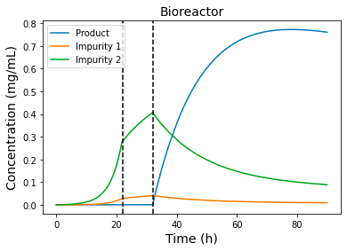

vLab: A Digital Twin and Simulation Library for Biopharmaceutical Manufacturing
===========

[](https://coe.northeastern.edu/people/xie-wei/)
[](https://cheme.mit.edu/profile/richard-d-braatz/)
[](https://niimbl.force.com/s/)
[](https://zhenghuazx.github.io/hua.zheng/)
[]()

vLab is a package for biopharmaceutical manufacturing simulation in Python. It utilizes the `diffeqpy`, 
a python wrapper of [DifferentialEquations.jl](http://diffeq.sciml.ai/dev/) and scipy built-in ode solver 
for its core routines to give high performance solving of large stiff differential equations, currently
including:

- N-linked Gycosylation (Perfusion Bioreactor) Simulation
- Raman Spectrometry and Raman Data Analytics
- Plantwise Simulation (Cell Culture and Chromatography)


If you have any questions, or just want to chat about using the package,
please feel free to contact me in the [Website](https://zhenghuazx.github.io/hua.zheng/). 
For bug reports, feature requests, etc., please submit an issue to the email <zheng.hua1@northeastern.edu>.

Installation (Linux and Mac OS)
======================================

## Part I: Install Julia and DifferentialEquations.jl
### For Linux
```bash
!curl -sSL "https://julialang-s3.julialang.org/bin/linux/x64/1.7/julia-1.7.2-linux-x86_64.tar.gz" -o julia.tar.gz
!tar -xzf julia.tar.gz -C /usr --strip-components 1
!rm -rf julia.tar.gz*
!julia -e 'using Pkg; pkg"add IJulia; add CuArrays; add Flux; precompile"'
```

### For Mac OS
- Step 1: Download your julia from [the JuliaLang site](https://julialang.org/downloads/).
- Step 2: Install Julia and set up environment
  * If you downloaded `.dmg` file (for example v1.6), install it and add julia to your PATH environmental variable by
    ```shell
    rm -f /usr/local/bin/julia
    ln -s /Applications/Julia-1.6.app/Contents/Resources/julia/bin/julia /usr/local/bin/julia
    ```

  - If you downloaded `tar.gz` file, unzip it first and move it to ~/Applications
    ```shell
    mv julia-1.6.0 /Applications/
    tar -xzf julia.tar.gz
    ```
  - then add julia to your PATH environmental variable by
    ```shell
    rm -f /usr/local/bin/julia
    ln -s /Applications/Julia-1.6.0/bin/julia /usr/local/bin/julia
    ```
- Step 3: Install Julia packages
```shell
julia -e 'using Pkg; pkg"add IJulia; add CuArrays; add Flux; precompile"'
```
- Step 4: Using diffeqpy requires that Julia is installed and in the path, along
  with DifferentialEquations.jl and PyCall.jl. To install Julia packages and PyCall and other dependencies.
```shell
python -c "import julia; julia.install(); import diffeqpy; diffeqpy.install()"
```

### Test your ``diffeqpy`` Installation on an ordinary differential equation (ODE) example
```python
from diffeqpy import de

def f(u,p,t):
    return -u

u0 = 0.5
tspan = (0., 1.)
prob = de.ODEProblem(f, u0, tspan)
sol = de.solve(prob)
```

## Part II： Install ``vLab``

### Option 1: Install ``vLab`` from source
If you would like to build the library from the source code, then at the root `/VirtualLab`, run
```shell
pip install build
python -m build
```
Then install vLab and clean up the directory
```shell
pip install dist/vLab-0.1.0-py3-none-any.whl 
rm -r dist
```

### Option 2: Install ``vLab`` from distribution
If you already have distribution (``*.whl`` file) and don't wnat to build the library, you can put vLab*.whl file to
your current directory and then run
```shell
pip install vLab-0.1.0-py3-none-any.whl 
```

### Test your ``vLab`` installation by running the plantwise simulation
```python
from vLab.IntegratedBioprocess.PlantwiseSimulator import PlantwiseSimulator

X0 = 0.1  # initial viable biomass concentration (g/L)
Sg0 = 40  # initial glycerol concentration (g/L)
Sm0 = 0  # initial methanol concentration (g/L)
P10 = 0  # initial product conentration (g/L)
P20 = 0
P30 = 0
VB0 = 0.5  # initial bioreactor volume (L)
VH0 = 1e-8  # initial hold tank volume (L)
x0 = [X0, Sg0, Sm0, P10, P20, P30, VB0, P10, P20, P30, VH0]
xC0 = [0] * (10 * 30 + 3)
x0 = x0 + xC0
import time

start_time = time.time()
solver = PlantwiseSimulator()
sol = solver.solve(x0)
elapse_time = time.time() - start_time
```

Then plot mAb trajectories.
```python
import numpy as np
import matplotlib.pyplot as plt

t = np.array(sol.t)
x = np.array(sol.x)

plt.plot(t, x[:, 3:6])
plt.axvline(solver._process_time[1], ls='--', c='k')
plt.axvline(solver._process_time[2], ls='--', c='k')
plt.title('Bioreactor', fontsize=14)
plt.ylabel('Concentration (mg/mL)', fontsize=14)
plt.xlabel('Time (h)', fontsize=14)
plt.legend(['Product', 'Impurity 1', 'Impurity 2'], loc='upper left')
plt.show()
```


You can also simulate the N-linked Glycosylation in a perfusion bioreactor as follows

```python
import numpy as np
from vLab.PerfusionSimulator.GlycosylationODESolver import ODESolver
from vLab.GlycosylationModelBase.GlycosylationNetwork import GlycosylationNetwork
from vLab.GlycosylationModelBase.GlycosylationModelParams import CellCultureVariables, GlycosylationModelParamClass

fp = GlycosylationNetwork(network_data_path='./data/Network Description.csv')
p = GlycosylationModelParamClass()
x = CellCultureVariables(1.5, 0.01, 0.1198, 66.3856,
                         np.array([0.490 + 1.452, 0.117 + 0.379, 0.058 + 0.190]) * 1e3,
                         np.array([1.62, 0.043, 0.1158, 0.040]) * 1e3)
# compute boundary conditions
ic = np.zeros((fp.nos + fp.nns + fp.nn))
ic[0] = x.mabtiter  # umol / L
ic[fp.nos:(fp.nos + fp.nns)] = x.nscyt * 40  # nucleotide sugar concentrations in umol / L.third entry is mystery
ic[fp.nos + 3] = x.udpgalcyt * 1e3 * 40  # updating with correct UDP-Gal concentration
ic[(fp.nos + fp.nns):] = x.ncyt  # sum of nucleotide concentrations in umol / L

t = [0, 1]
ode_solver = ODESolver(t, ic, x, p, fp)
HM, FA1G1, FA2G0, FA2G1, FA2G2, SIA = ode_solver.solve()
for x in ode_solver.os[:, -1]:
  print("{:10.4f}".format(x))
```


Installation Guide For Windows Users
======================================
We advise either using a linux virtual machine or use Google Colab (a free Jupyter notebook).

* Step 1: upload "vLab-0.1.0-py3-none-any.whl" to your google drive at "/content/drive/MyDrive".

* Step 2: Open google colab by either using your google drive or through the
  [Link Here](https://colab.research.google.com/).

* Step 3: run the following command in Colab to mount your google drive and set current directory to
  '/content/drive/MyDrive' (where you upload vLab package "vLab-0.1.0-py3-none-any.whl",)
```python
import os
from google.colab import drive
drive.mount('/content/drive')
os.chdir('/content/drive/MyDrive')
```

* Step 4: run the follwing commmand to install diffeqpy and vLab
```python
!pip install diffeqpy
!pip install vLab-0.1.0-py3-none-any.whl
!pip install spc_spectra
 ```
* Step 5: run the follwing commmand to install julia and required packages in julia. (**Ignore them if you encounter some errors. Those errors related to GPU computing.**)
```python
!curl -sSL "https://julialang-s3.julialang.org/bin/linux/x64/1.6/julia-1.6.0-linux-x86_64.tar.gz" -o julia.tar.gz
!tar -xzf julia.tar.gz -C /usr --strip-components 1
!rm -rf julia.tar.gz*
!julia -e 'using Pkg; pkg"add IJulia; add CuArrays; add Flux; precompile"'
```

Step 6: Install Julia packages from python (Both Mac and Linux)
```python
import diffeqpy
diffeqpy.install()
```

Step 7： Run the following command to turn off Julia compilation cache when your Python interpreter is statically linked to libpython
(Often happened in Debian-based Linux distribution). See more details [Here](https://pyjulia.readthedocs.io/en/latest/troubleshooting.html).
```python
from julia.api import Julia
jl = Julia(compiled_modules=False)
```
Step 8: Great! Now you can use vLab! Run the following plantwise simulation. **Note: the first run will take 15-30 minutes
to allow the python/julia to download and install all required packages!**
```python
from vLab.IntegratedBioprocess.PlantwiseSimulator import PlantwiseSimulator

X0 = 0.1  # initial viable biomass concentration (g/L)
Sg0 = 40  # initial glycerol concentration (g/L)
Sm0 = 0  # initial methanol concentration (g/L)
P10 = 0  # initial product conentration (g/L)
P20 = 0
P30 = 0
VB0 = 0.5  # initial bioreactor volume (L)
VH0 = 1e-8  # initial hold tank volume (L)
x0 = [X0, Sg0, Sm0, P10, P20, P30, VB0, P10, P20, P30, VH0]
xC0 = [0] * (10 * 30 + 3)
x0 = x0 + xC0
import time

start_time = time.time()
solver = PlantwiseSimulator()
sol = solver.solve(x0)
elapse_time = time.time() - start_time
```