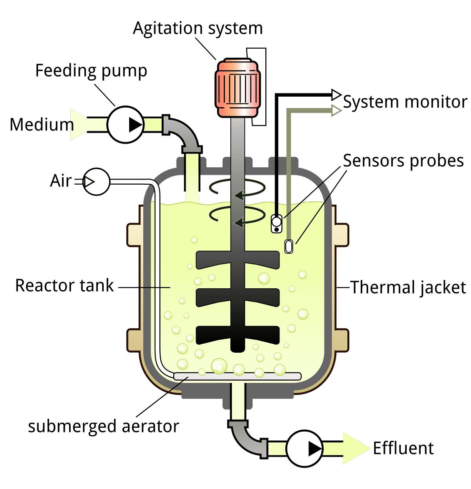
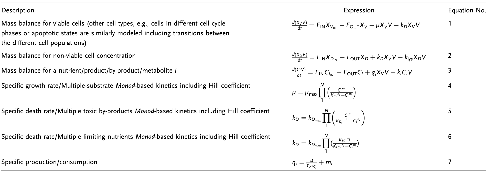

Traditionally, biopharmaceutical researchers/engineers relied on an experimental approach to extract data and information from cell cultures and evaluate how the system inputs such as media formulation, temperature, and pH affect the outputs, i.e., cell growth, cell viability, product titer, and quality, in an intuitive or statistical manner. However, this conventional approach is highly undesirable in industrial settings owing to the cost and time of the required experimentation. In this regard, mathematically representing  the cell culture systems and subsequent analysis for better understanding via appropriate in silico techniques can be considered as a promising approach. Importantly, mathematical models help organize and integrate the existing data in a systematic way. The constructed models can therefore be used to predict cellular responses to various environmental/genetic perturbations, and to identify targets for host cell line engineering to improve culture performance.

## Cell Culture Fermentation Modeling Types

Bioreactors are modeled similarly to stirred tank chemical reactors

A mass balance equation can be used as a first principles model to understand the interaction between the CPP's and CQA's

Biological reaction rate models are structured or unstructured, non-segregated or segregated

* Unstructured: Reaction rate depends only on concentrations external to the cell

* Structured: Reaction rate is also dependent on concentrations in intercellular components

* Non-segregated: All cells are treated as identical

* Segregated: Multiple populations of cells with different characteristics

## General Approach

Typicaally a kinetic model consists of differential algebraic equations (DAEs) that can be derived from the time-dependent mass balances of participating components with appropriate mechanistic or empirical kinetic equations, e.g., Monod kinetics ,mass action   kinetics, and Michaelis–Menten kinetics. Some models only use ordinary differential equations (ODEs) through simplifying assumptions.

*Table*: Mass balances for viable cells and nutrients/by-products/meta-bolites/product around the bioreactor as well as unstructured Monod based equations is provided in the following table (Table adopted from [1]).

**Notations**:

- $X_V$, viable cell concentration;
- $V$ culture volume;
- $F_{IN}$,flow rate in the culture (for fed-batch or perfusion modes);
- $X_{V_{IN}}$, viable cell concentration in the inflow;
- $F_{OUT}$,flow rateout of the bioreactor;
- $\mu$, specific growth rate;
- $k_d$, specific death rate;
- $k_{lys}$, lysis rate;
- $X_D$, non-viable (“dead”) cell concentration;
- $C_i$, molar concentration of a nutrient/product/by-product/metabolite (based on context) $i$;
- $C_{i_{IN}}$, molar concentration of $i$ the inflow;
- $q_i$, specific consumption/production rate (negative or positive, respectively);
- $k_i$, chemical/non-enzymatic degradation rate of $i$, if applicable, assuming first-order degradation (negative if $i$ is degrading, positive if another product is degrading to $i$);
- $\mu_{max}$, maximum specific growth rate;
- $k_{C_i}$, half-velocity constant;
- $N$, total number of considered limiting substrates for Equations 4 and 6, and total number of considered toxic products in Equation 5;
- $k_{D_{max}}$, maximum specific death rate;
- $n_i$, Hill coefficient;
- $K_{D_{C_i}}$, death-associated half-velocity constant;
- $K_{I_{C_i}}$, inhibitor-associated half-velocity constant;
- $Y_{X/C_i}$, yield of cells to $C_i$;
- $m_i$, maintenance coefficient.

Mass balances for various cell types (e.g.,cells in distinct apoptotic phases or in different stages of cell cycle) can be distinguished by including transition rates between the different cell populations. The important variables to be de fined in these mass balances are the specific rates, i.e., cell growth ($m$), cell death ($k_D$), and metabolite production/consumption ($q_i$),that dynamically change during the culture process.
## Perfusion Bioreactor

Lu et al. [1] modeled the growth and energy metabolism of Pichia pastoris producing a fusion protein under glycerol and methanol feed using an unstructured, nonsegregated model.

Biological kinetic models can be classified as unstructured nonsegregated model whose reaction rate depends only on concentrations external to the cell and all cells are taken to be identical. The differential equations are listed as below

#### Bioreactor Kinetic Model
$$
\begin{align*}
\frac{dX}{dt}&=-\frac{F_{in}-F_{out}}{V}X+(\mu_g+\mu_m)X\\
\frac{dS_g}{dt}&=\frac{F_{in}}{V}(S_{in,g}-S_g)-q_{S_g}X\\
\frac{dS_m}{dt}&=\frac{F_{in}}{V}(S_{i,m}-S_m)-q_{S_m}X\\
\frac{dP_i}{dt}&=-\frac{F_{in}}{V}P_i+q_{P_i}X\\
\frac{dV}{dt}&=F_{in}-F_{out}
\end{align*}
$$

#### Harvest/Hold Tank Model
$$
\begin{align*}
\frac{dP_i}{dt}&=-\frac{F_{in}}{V}(P_{i,in}-P_i)\\
\frac{dV}{dt}&=F_{in}-F_{out}
\end{align*}
$$

$𝑋$: biomass\
$𝐹_𝑖𝑛$: inlet flow rate (L/h)\
$𝐹_𝑜𝑢𝑡$: outlet flow rate (L/h)\
$𝜇_𝑔$,$𝜇_𝑚$: Specific growth rate\
$𝑆_{𝑖𝑛,𝑔}$: inlet glycerol concentration (g/L)\
$𝑆_{𝑖𝑛,𝑚}$: inlet methanol concentration (g/L)\
$𝑆_𝑔$: glycerol concentration (g/L)\
$𝑆_𝑚$: methanol concentration (g/L)\
$𝑞_{𝑆_𝑔}$,$𝑞_{𝑆_𝑚}$: Specific rate of substrate consumption (g/g-h)\
$𝑞_{𝑃_𝑖}$: Specific product production rate (g/g-h)\
$𝑃_𝑖$: protein $𝑖$\
$𝑉$: bioreactor volume (L)

### Reference

1. Kyriakopoulos, S., Ang, K.S., Lakshmanan, M., Huang, Z., Yoon, S., Gunawan, R. and Lee, D.Y., 2018. Kinetic modeling of mammalian cell culture bioprocessing: the quest to advance biomanufacturing. *Biotechnology Journal*, *13* (3), p.1700229.
2. Lu, A.E., Paulson, J.A., Mozdzierz, N.J., Stockdale, A., Versypt, A.N.F., Love, K.R., Love, J.C. and Braatz, R.D., 2015, September. Control systems technology in the advanced manufacturing of biologic drugs. In *2015 IEEE Conference on Control Applications (CCA)*
   (pp. 1505-1515). IEEE.