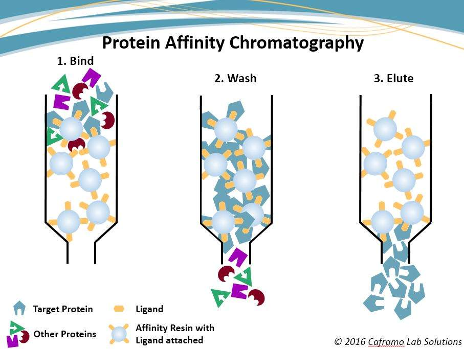
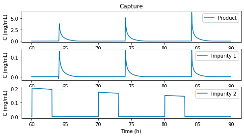

The downstream process of biopharma manufacturing typically has multiple purification unit operations, each with a slightly different mechanism and purpose, and end purity goal. Chromatography is arguably the most important unit operation in purification, and here we will introduce and explain a general mechanism model for the process of chromatography.

## Chromatography Modeling
In chromatography, mechanistic modeling can be used to simulate elution profiles under different conditions such as column dimensions, load ratio, flow rate and conductivity. 
Simulations can be performed for both major and minor sample components. The output can then be used to optimize the separation. The following  image shows the elution profiles of capture column 
in three steps.

**Chromatography simulation model** is built on mechanistic model combining SMA adsorption kinetic models and mass transport models (such as GRM, Thomas model, Transport model).

General rate model (GRM) is the most comprehensive rate model to date. The solution of GRM requires solving a set of PDEs including mass balance, mass transfer, and adsorption kinetic equations in the column and in the stationary phase. The general rate model of chromatography uses two mass balance equations, **one in the mobile phase outside the particle** and **the other in the stagnant mobile phase inside a particle**, and two kinetic equations, one relating the two mobile phase concentrations (**mass transfer kinetics**) and the other relating the stagnant mobile phase and the stationary phase concentrations (**kinetics of adsorption-desorption**).

## A Mechanistic Model

We provide a state-of-the-art chromatography modeling example that used the steric mass action (SMA) isotherm with a nonideal transport model.

### Mobile phase (**Mass Transfer Kinetics**)

- Nonideal transport model for the concentration of $i$th species. The first term on the right-hand side describes the convective transport through the column, the second term the dispersive transport and the third term the interaction between mobile and absorbed phase

$$
\frac{\partial C_i}{\partial t}\varepsilon_{tot}=-\frac{\partial C_i}{\partial z}+\frac{1}{Pe}\frac{\partial^2 C_i}{\partial z^2}-\frac{q_i}{\partial t}\varepsilon_{pore}
$$

- The mass balance of salt whose concentration is denoted by $C_{salt}$

$$
\frac{\partial C_{salt}}{\partial t}\varepsilon_{tot}=-\frac{\partial C_{salt}}{\partial z}+\frac{1}{Pe}\frac{\partial^2 C_{saltt}}{\partial z^2}
$$

### Absored/Stationary Phase (**kinetics of adsorption-desorption**)

The time dependent change of the concentration of species $i$ on the adsorbent surface

$$
\frac{\partial q_i}{dt}=k_{ads,i}C_i \bar{Q}^{v_i}-k_{des,i}q_iC^{v_i}_{salt}
$$

**Notations**: $C_i$ is the concentration of species $i$ in the liquid phase, $t$ is the time, $\varepsilon_{tot}$ is the total porosity, $z\in[0, 1]$ is the dimensionless length, $Pe$ is the Peclet number, $q_i$ is the concentration of species $i$ in the adsorbed phase, and $\varepsilon_{pore}$ is the particle porosity. $k_{ads,i}$ is the rate constant of adsorption for component $i$, $Q$ is the number of ligands available for adsorption and desorption, $v_i$ is the characteristic charge of component $i$, $k_{des,i}$ is the rate constant of desorption for component $i$.

**Reference**: Sejergaard, L., Karkov, H. S., Krarup, J. K., Hagel, A. B. B., & Cramer, S. M. (2014). Model‐based process development for the purification of a modified human growth hormone using multimodal chromatography. Biotechnology Progress,30(5), 1057-1064.