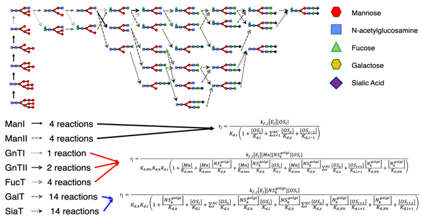
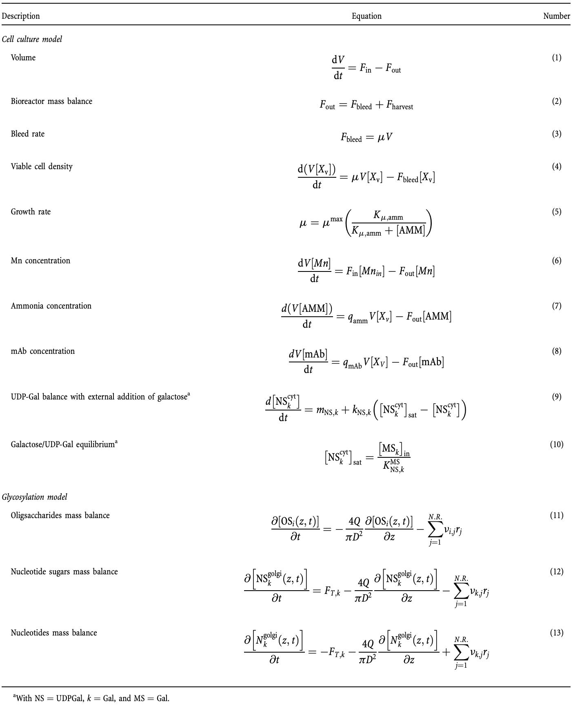
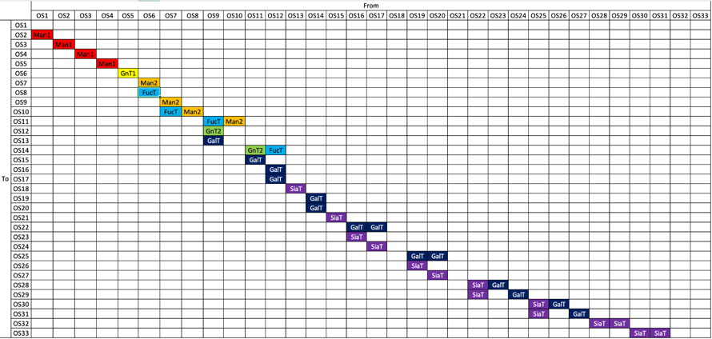

## High Level Model Overview

The glycosylation model is based on the cisternal maturation
assumption with recycling of Golgi resident proteins first proposed
by Jimenez del Val et al. (2011). The mass balances for the species
involved were calculated considering the Golgi apparatus as a single
plug flow reactor operating at steady state according to equations (11)-(13) and the
reaction scheme reported in the figure below. The effect of the operating conditions on N-glycosylation was simulated
by linking the kinetics of enzymatic reactions to the availability of
sugar precursors, and the concentrations of metal ions and  ammonia.

## Model Description
Mass balance equations for the unstructured cell culture model and the mechanistic glycosylation model adapted from
Karst et. al. (2017). The modeling framework can be divided in two sections. The first part comprises a simple 
unstructured cell culture model for the estimation of cell  specific parameters (e.g., growth rate, ammonia and antibody
specific productivities) and process related values (e.g., bleed rate). The mass balances of the perfusion bioreactor 
are based on the assumption of a CSTR reactor (e.g., perfect mixing).

### Unstructured cell culture model
An unstructured cell culture model [1-10] was used to describeviable cell density, specific productivity, ammonia produc-tion,and intracellular nucleotide sugars as shown in Table 1.The initial conditions were taken from measurements at the beginning of the culture.

### Structured model of N-linked glycosylation
A dynamic mechanistic model [11-13] of mAb Fc N-linked glyco-sylation was adapted from Del Val et al., describing cisternal maturation of the Golgi apparatus as a single plug flowreactor (PFR) including recycling of Golgi-resident proteins and transport equation for nucleotide sugars.

### Kinetic Reaction Network: column (reactant), row (product), cell (enzyme)
In fact, the reaction network can be represented in a matrix form. The following figure of reaction scheme describes the 
N-glycosylation for the mAb in the mechanistic model. This network defines the reactant (column), product (row) and enzyme (cell) involved
in each reaction.

**Reference**:
1. Karst, D. J., Scibona, E., Serra, E., Bielser, J. M., Souquet, J., Stettler, M., ... & Villiger, T. K.
   (2017). Modulation and modeling of monoclonal antibody N‐linked glycosylation in mammalian cell perfusion reactors.
   Biotechnology and bioengineering, 114(9), 1978-1990.
2. Jimenez del Val, I., Nagy, J. M., & Kontoravdi, C. (2011). A dynamic mathematical model for monoclonal antibody N‐linked glycosylation and nucleotide sugar donor transport within a maturing Golgi apparatus. Biotechnology progress, 27(6), 1730-1743.
