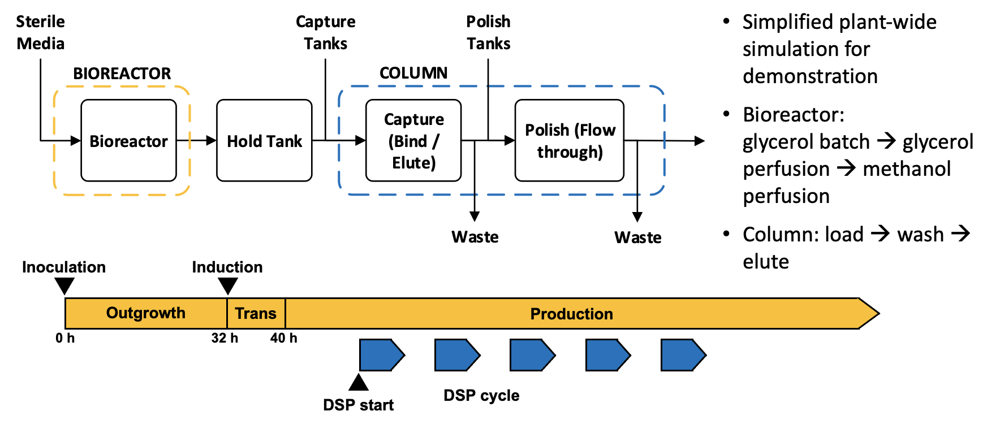

In this lecture, we focus on a perfusion biorecator of Pichia pastoris cells, which includes

1. State-of-the-art models in chromatography,
2. Perfusion bioreactors
3. Uuse of models for integrated process simulation and prediction.

The simulation model and implementation is adapted from [1].

# Diagram

In the bioprocessing industry, most work has revolved around modeling unit operations [11]. Models for bioreactors and chromatography  are mature and will be briefly reviewed in the subsequent subsections. However, the unit operations do not operate in isolation, and changing
a unit’s operating conditions will impact downstream processing. This motivates integrated plant models.

# Potential Usage

- Consider integrated perfusion bioreactor and chromatograph purification.
- Conduct long-term predictive analysis, e.g., how the feeding strategy at different times of bioreactor impact on the trajectory and variation of integrated biomanufacturing processes
- Find the optimal and robust control strategies for this integrated process

## Reference

1. Lu, A.E., Paulson, J.A., Mozdzierz, N.J., Stockdale, A., Versypt, A.N.F., Love, K.R., Love, J.C. and Braatz, R.D., 2015, September. Control systems technology in the advanced manufacturing of biologic drugs. In *2015 IEEE Conference on Control Applications (CCA)*
   (pp. 1505-1515). IEEE.