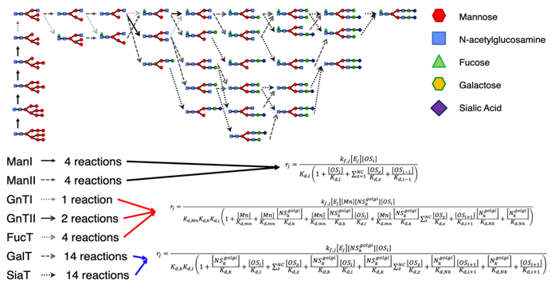
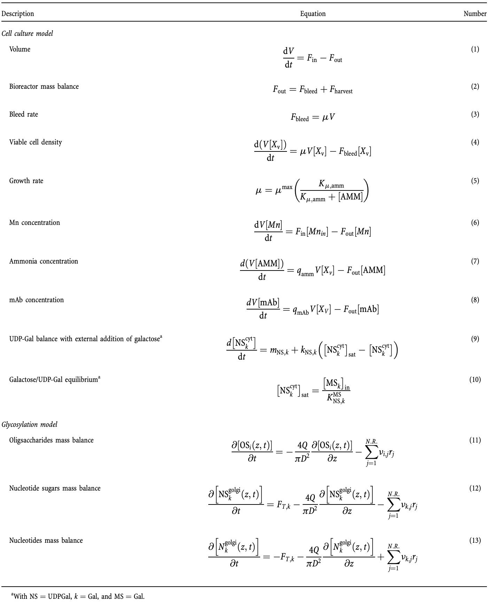
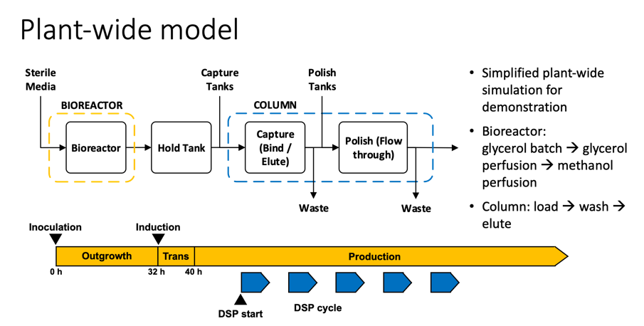

N-linked Glycosylation Simulation
------------------
#### High Level Model Overview

The glycosylation model is based on the cisternal maturation
assumption with recycling of Golgi resident proteins first proposed
by Jimenez del Val et al. (2011). The mass balances for the species
involved were calculated considering the Golgi apparatus as a single
plug flow reactor operating at steady state according to equations (11)-(13) and the
reaction scheme reported in the figure below. The effect of the operating conditions on N-glycosylation was simulated
by linking the kinetics of enzymatic reactions to the availability of
sugar precursors, and the concentrations of metal ions and  ammonia.

#### Model Description
Mass balance equations for the unstructured cell culture model and the mechanistic glycosylation model adapted from
Karst et. al. (2017). The modeling framework can be divided in two sections. The first part comprises a simple 
unstructured cell culture model for the estimation of cell  specific parameters (e.g., growth rate, ammonia and antibody
specific productivities) and process related values (e.g., bleed rate). The mass balances of the perfusion bioreactor 
are based on the assumption of a CSTR reactor (e.g., perfect mixing).

**Reference**: Karst, D. J., Scibona, E., Serra, E., Bielser, J. M., Souquet, J., Stettler, M., ... & Villiger, T. K. 
(2017). Modulation and modeling of monoclonal antibody N‐linked glycosylation in mammalian cell perfusion reactors. 
Biotechnology and bioengineering, 114(9), 1978-1990.

#### Kinetic Reaction Network: column (reactant), row (product), cell (enzyme)

Plantwise Simulation
------------------

**Reference**: Amos E. Lu, Joe A. Paulson, Nicholas J. Mozdzierz, Alan Stockdale, Ashlee N. Ford Versypt, 
Kerry R. Lov, J. Christopher Love, Richard D. Braatz (2015). Control Systems Technology in the Advanced Manufacturing 
of Biologic Drugs. CCA.

#### Bioreactor Kinetic Model
$$
\begin{align*}
\frac{dX}{dt}&=-\frac{F_{in}-F_{out}}{V}X+(\mu_g+\mu_m)X\\
\frac{dS_g}{dt}&=\frac{F_{in}}{V}(S_{in,g}-S_g)-q_{S_g}X\\
\frac{dS_m}{dt}&=\frac{F_{in}}{V}(S_{i,m}-S_m)-q_{S_m}X\\
\frac{dP_i}{dt}&=-\frac{F_{in}}{V}P_i+q_{P_i}X\\
\frac{dV}{dt}&=F_{in}-F_{out}
\end{align*}
$$

#### Harvest/Hold Tank Model
$$
\begin{align*}
\frac{dP_i}{dt}&=-\frac{F_{in}}{V}(P_{i,in}-P_i)\\
\frac{dV}{dt}&=F_{in}-F_{out}
\end{align*}
$$

$𝑋$: biomass\
$𝐹_𝑖𝑛$: inlet flow rate (L/h)\
$𝐹_𝑜𝑢𝑡$: outlet flow rate (L/h)\
$𝜇_𝑔$,$𝜇_𝑚$: Specific growth rate\
$𝑆_{𝑖𝑛,𝑔}$: inlet glycerol concentration (g/L)\
$𝑆_{𝑖𝑛,𝑚}$: inlet methanol concentration (g/L)\
$𝑆_𝑔$: glycerol concentration (g/L)\
$𝑆_𝑚$: methanol concentration (g/L)\
$𝑞_{𝑆_𝑔}$,$𝑞_{𝑆_𝑚}$: Specific rate of substrate consumption (g/g-h)\
$𝑞_{𝑃_𝑖}$: Specific product production rate (g/g-h)\
$𝑃_𝑖$: protein $𝑖$\
$𝑉$: bioreactor volume (L)

#### Chromatography Model
Mobile phase (lipid phase)
   - Nonideal transport model for the concentration of species $i$th species

$$
\frac{\partial C_i}{\partial \theta}\epsilon_{tot}=-\frac{\partial C_i}{dz}+\frac{1}{\text{Pe}}\frac{\partial^2 C_i}{\partial z^2}-\frac{q_i}{\theta}\epsilon_{pore}
$$

  - The mass balance of salt whose concentration is denoted by $𝐶_{𝑠𝑎𝑙𝑡}$, is

$$
\frac{\partial C_{salt}}{\partial \theta}\epsilon_{tot}=-\frac{\partial C_{salt}}{dz}+\frac{1}{\text{Pe}}\frac{\partial^2 C_{salt}}{\partial z^2}
$$

Adsorbed (stationary) phase: the kinetics of the adsorption are

$$
\frac{\partial q_i}{\partial \theta}=k_{ads,i}C_i \bar{Q}^{v_i}-k_{des,i}q_iC^{v_i}_{salt}.
$$

where $C_i$ is the concentration of species $i$ in the liquid phase, $\theta$ is the dimensionless time, 
$\epsilon_{tot}$ is the total porosity, $z\in[0,1]$ is the dimensionless length, $Pe$ is the Peclet number, $q_i$ is 
the concentration of species $i$ in the adsorbed phase, and $\epsilon_pore$ is the particle porosity. $k_{ads,i}$ is 
the rate constant of adsorption for component $i$, $Q$ is the number of ligands available for adsorption and desorption, 
$v_i$ is the characteristic charge of component $i$, $k_{des,i}$ is the rate constant of desorption for component $i$.

**Reference**: Sejergaard, L., Karkov, H. S., Krarup, J. K., Hagel, A. B. B., & Cramer, S. M. (2014). Model‐based process 
development for the purification of a modified human growth hormone using multimodal chromatography. Biotechnology 
Progress,30(5), 1057-1064.